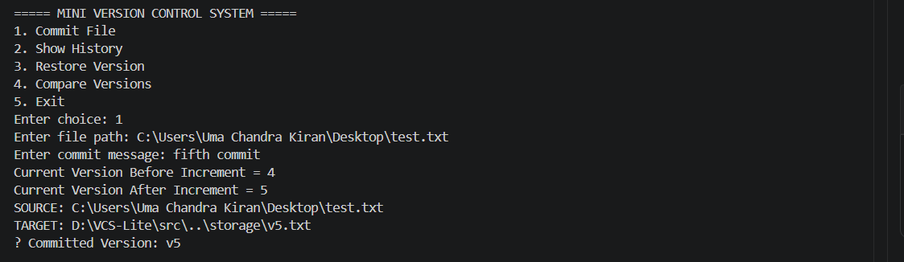
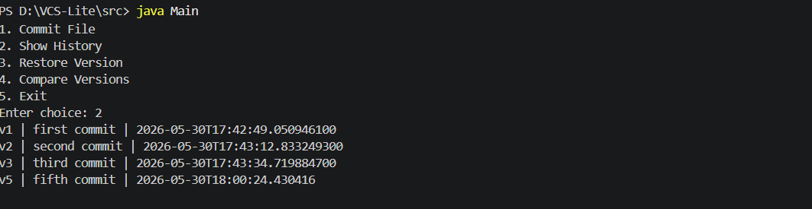
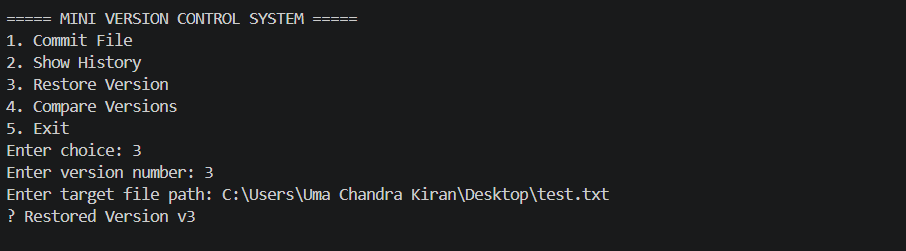
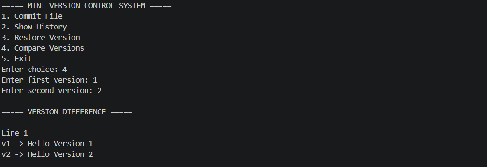

# Mini Version Control System (VCS-Lite)

## Overview

VCS-Lite is a Java-based Mini Version Control System that allows users to:

- Commit file snapshots
- Track version history
- Restore previous versions
- Compare versions (Diff)
- Persist commit history across restarts

The project is inspired by the core concepts of Git and version control systems.

---

## Features

### Commit Files
Create snapshots of files and store them as versions.

### Version History
View all committed versions along with timestamps and messages.

### Restore Versions
Rollback files to a previous version.

### Compare Versions
Compare two versions line-by-line and display differences.

### Persistent Storage
Commit history remains available even after restarting the application.

---

## Technologies Used

- Java
- OOP (Object-Oriented Programming)
- Java NIO
- Collections Framework
- File Handling
- BufferedReader / BufferedWriter

---

## Project Structure

```text
VCS-Lite
│
├── src
│   ├── Main.java
│   ├── VersionManager.java
│   ├── FileStorage.java
│   ├── HistoryManager.java
│   ├── DiffManager.java
│   └── Version.java
│
├── storage
│   ├── history.txt
│   ├── v1.txt
│   ├── v2.txt
│   └── ...
│
└── README.md
```
## Screenshots

### Commit



### History



### Restore



### Diff


---

## Learning Outcomes

- Java File Handling
- Java NIO APIs
- Version Management Concepts
- Snapshot-Based Storage
- Data Persistence
- Exception Handling
- Collections Framework

---

## Future Improvements

- Branch Support
- Merge Functionality
- User Authentication
- GUI Version
- Database Storage

---

## Author

Uma Chandra Kiran Gangumalla
